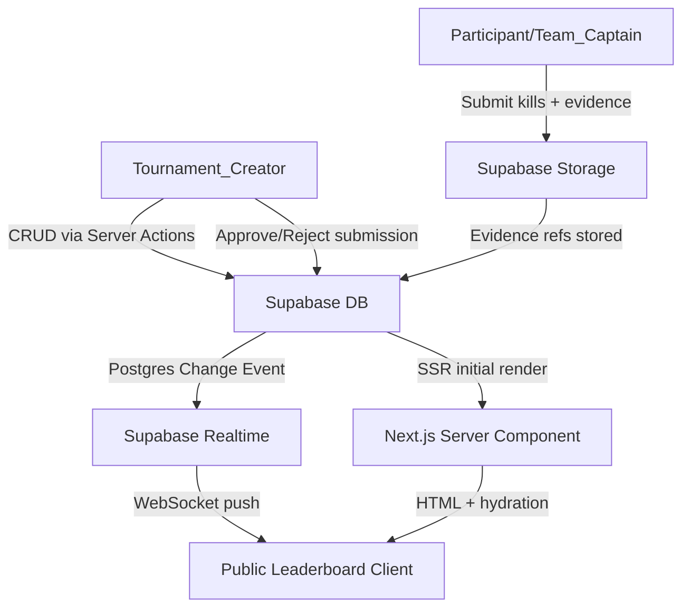

# Design Document: Tournament Leaderboard Platform

## Overview

Plataforma web profesional de torneos competitivos estilo eSports construida con Next.js 14+ (App Router), Supabase y Tailwind CSS. El sistema permite a Tournament_Creators configurar torneos con múltiples formatos (Battle Royale, Kill Race, Bracket, Grupos), gestionar participantes y equipos, aprobar submissions con evidencias, y publicar tablas de posiciones en tiempo real con temas visuales premium.

### Principios de diseño

- **Real-time first**: Supabase Realtime para actualizaciones de leaderboard sin polling manual
- **Public-first**: La vista pública es el producto principal — accesible sin auth, optimizada para espectadores
- **Premium visual**: Paletas eSports, tipografía impactante, micro-animaciones fluidas (Framer Motion)
- **Creator-centric**: El Tournament_Creator tiene control total sobre configuración, scoring y apariencia
- **Performance**: Server Components para SEO y carga inicial, Client Components solo donde se necesita interactividad

### Stack tecnológico

| Capa | Tecnología |
|------|-----------|
| Framework | Next.js 14+ (App Router) |
| Lenguaje | TypeScript strict |
| Base de datos | Supabase (PostgreSQL) |
| Auth | Supabase Auth |
| Storage | Supabase Storage |
| Realtime | Supabase Realtime (Postgres Changes) |
| Estilos | Tailwind CSS + shadcn/ui |
| Animaciones | Framer Motion |
| Deploy | Vercel |
| Validación | Zod |
| Forms | React Hook Form + Zod |
| State | Zustand (client state mínimo) |

---

## Architecture

### Estructura de directorios

```
src/
├── app/
│   ├── (auth)/
│   │   ├── login/page.tsx
│   │   └── register/page.tsx
│   ├── (dashboard)/
│   │   ├── layout.tsx                    # Dashboard layout con sidebar
│   │   ├── tournaments/
│   │   │   ├── page.tsx                  # Lista de torneos del creator
│   │   │   ├── new/page.tsx              # Crear torneo
│   │   │   └── [id]/
│   │   │       ├── page.tsx              # Overview del torneo
│   │   │       ├── participants/page.tsx
│   │   │       ├── submissions/page.tsx
│   │   │       ├── scoring/page.tsx
│   │   │       └── customize/page.tsx    # Personalización visual
│   ├── t/
│   │   └── [slug]/
│   │       └── page.tsx                  # Public leaderboard view (SSR + Realtime)
│   ├── layout.tsx
│   └── globals.css
├── components/
│   ├── leaderboard/
│   │   ├── LeaderboardTable.tsx          # Tabla principal con animaciones
│   │   ├── LeaderboardRow.tsx            # Fila con rank, team, métricas
│   │   ├── BracketView.tsx               # Vista de bracket eliminación directa
│   │   ├── GroupStageView.tsx            # Vista de fase de grupos
│   │   ├── ScoringInfoPanel.tsx          # Panel de reglas de puntuación
│   │   ├── TournamentHeader.tsx          # Header con logo, banner, status
│   │   └── ThemeProvider.tsx             # Aplicación de tema dinámico
│   ├── dashboard/
│   │   ├── TournamentForm.tsx            # Formulario creación/edición
│   │   ├── ParticipantManager.tsx        # Gestión de participantes
│   │   ├── SubmissionReviewer.tsx        # Aprobación/rechazo de submissions
│   │   ├── ScoringRuleEditor.tsx         # Editor de reglas de puntuación
│   │   └── CustomizePanel.tsx            # Panel de personalización visual
│   └── ui/                               # shadcn/ui components
├── lib/
│   ├── supabase/
│   │   ├── client.ts                     # Browser client
│   │   ├── server.ts                     # Server client (cookies)
│   │   └── middleware.ts
│   ├── scoring/
│   │   └── engine.ts                     # Scoring Engine puro (sin side effects)
│   ├── validations/
│   │   └── schemas.ts                    # Zod schemas
│   └── utils.ts
├── hooks/
│   ├── useLeaderboard.ts                 # Realtime leaderboard subscription
│   ├── useTournament.ts
│   └── useSubmissions.ts
└── types/
    └── index.ts                          # Tipos TypeScript globales
```

### Flujo de datos



### Patrones de arquitectura

**Server Components (RSC)** para:
- Carga inicial del leaderboard público (SEO, performance)
- Dashboard pages (datos del creator)
- Formularios de configuración

**Client Components** para:
- Suscripción Realtime al leaderboard
- Drag-and-drop de columnas
- Animaciones de posición (Framer Motion)
- Upload de evidencias con preview

**Server Actions** para:
- Crear/actualizar torneos
- Aprobar/rechazar submissions
- Guardar configuración visual
- Gestión de participantes

---

## Components and Interfaces

### Leaderboard público (`/t/[slug]`)

```typescript
// TournamentHeader — banner, logo, status badge, countdown
interface TournamentHeaderProps {
  tournament: TournamentPublic;
  theme: LeaderboardTheme;
}

// LeaderboardTable — tabla principal con animaciones de posición
interface LeaderboardTableProps {
  teams: TeamStanding[];
  columns: ColumnConfig[];
  theme: LeaderboardTheme;
  format: CompetitionFormat;
}

// LeaderboardRow — fila individual con rank change animation
interface LeaderboardRowProps {
  standing: TeamStanding;
  position: number;
  previousPosition?: number;
  columns: ColumnConfig[];
  theme: LeaderboardTheme;
}

// ScoringInfoPanel — reglas de puntuación visibles al público
interface ScoringInfoPanelProps {
  scoringRule: ScoringRule;
  format: CompetitionFormat;
  matchesTotal: number;
  matchesCompleted: number;
}

// BracketView — árbol de eliminación directa
interface BracketViewProps {
  bracket: BracketRound[];
  theme: LeaderboardTheme;
}
```

### Dashboard (autenticado)

```typescript
// TournamentForm — creación y edición de torneos
interface TournamentFormProps {
  tournament?: Tournament;
  onSuccess: (id: string) => void;
}

// ParticipantManager — lista, agregar, eliminar participantes y equipos
interface ParticipantManagerProps {
  tournamentId: string;
  mode: TournamentMode;
  status: TournamentStatus;
}

// SubmissionReviewer — cola de submissions pendientes con evidencias
interface SubmissionReviewerProps {
  tournamentId: string;
  level: TournamentLevel;
}

// CustomizePanel — editor visual con preview en tiempo real
interface CustomizePanelProps {
  tournamentId: string;
  currentTheme: LeaderboardTheme;
}
```

### Server Actions

```typescript
// tournaments
createTournament(data: CreateTournamentInput): Promise<Tournament>
updateTournament(id: string, data: UpdateTournamentInput): Promise<Tournament>
activateTournament(id: string): Promise<void>

// participants
addParticipant(tournamentId: string, data: AddParticipantInput): Promise<Participant>
createTeam(tournamentId: string, data: CreateTeamInput): Promise<Team>
removeParticipant(tournamentId: string, participantId: string): Promise<void>

// submissions
approveSubmission(submissionId: string): Promise<void>
rejectSubmission(submissionId: string, reason: string): Promise<void>
submitKills(data: SubmitKillsInput): Promise<Submission>

// customization
saveTheme(tournamentId: string, theme: LeaderboardTheme): Promise<void>
uploadAsset(tournamentId: string, file: File, type: 'logo' | 'banner'): Promise<string>
```

---

## Data Models

### Supabase PostgreSQL Schema

```sql
-- Enums
CREATE TYPE tournament_mode AS ENUM ('individual', 'duos', 'trios', 'cuartetos');
CREATE TYPE competition_format AS ENUM (
  'battle_royale_clasico', 'kill_race', 'custom_rooms',
  'eliminacion_directa', 'fase_de_grupos'
);
CREATE TYPE tournament_level AS ENUM ('casual', 'profesional');
CREATE TYPE tournament_status AS ENUM ('draft', 'active', 'finished');
CREATE TYPE submission_status AS ENUM ('pending', 'approved', 'rejected');

-- Tournaments
CREATE TABLE tournaments (
  id            UUID PRIMARY KEY DEFAULT gen_random_uuid(),
  creator_id    UUID NOT NULL REFERENCES auth.users(id) ON DELETE CASCADE,
  name          VARCHAR(255) NOT NULL,
  description   TEXT,
  rules_text    TEXT CHECK (char_length(rules_text) <= 5000),
  slug          VARCHAR(100) UNIQUE NOT NULL,
  mode          tournament_mode NOT NULL,
  format        competition_format NOT NULL,
  level         tournament_level NOT NULL DEFAULT 'casual',
  status        tournament_status NOT NULL DEFAULT 'draft',
  total_matches INTEGER NOT NULL CHECK (total_matches > 0),
  matches_completed INTEGER NOT NULL DEFAULT 0,
  kill_rate_enabled BOOLEAN NOT NULL DEFAULT true,
  pot_top_enabled   BOOLEAN NOT NULL DEFAULT true,
  vip_enabled       BOOLEAN NOT NULL DEFAULT false,
  tiebreaker_match_enabled BOOLEAN NOT NULL DEFAULT false,
  kill_race_time_limit_minutes INTEGER,
  start_date    TIMESTAMPTZ,
  end_date      TIMESTAMPTZ,
  created_at    TIMESTAMPTZ NOT NULL DEFAULT now(),
  updated_at    TIMESTAMPTZ NOT NULL DEFAULT now()
);

-- Scoring Rules (una por torneo activa)
CREATE TABLE scoring_rules (
  id              UUID PRIMARY KEY DEFAULT gen_random_uuid(),
  tournament_id   UUID NOT NULL REFERENCES tournaments(id) ON DELETE CASCADE,
  kill_points     NUMERIC(6,2) NOT NULL CHECK (kill_points >= 0),
  placement_points JSONB NOT NULL, -- {"1": 10, "2": 7, "3": 5, ...}
  created_at      TIMESTAMPTZ NOT NULL DEFAULT now()
);

-- Teams
CREATE TABLE teams (
  id            UUID PRIMARY KEY DEFAULT gen_random_uuid(),
  tournament_id UUID NOT NULL REFERENCES tournaments(id) ON DELETE CASCADE,
  name          VARCHAR(100) NOT NULL,
  avatar_url    TEXT,
  vip_score     NUMERIC(8,2) NOT NULL DEFAULT 0,
  created_at    TIMESTAMPTZ NOT NULL DEFAULT now(),
  UNIQUE (tournament_id, name)
);

-- Participants
CREATE TABLE participants (
  id            UUID PRIMARY KEY DEFAULT gen_random_uuid(),
  tournament_id UUID NOT NULL REFERENCES tournaments(id) ON DELETE CASCADE,
  team_id       UUID REFERENCES teams(id) ON DELETE SET NULL,
  display_name  VARCHAR(100) NOT NULL,
  contact_id    VARCHAR(255),
  is_captain    BOOLEAN NOT NULL DEFAULT false,
  created_at    TIMESTAMPTZ NOT NULL DEFAULT now(),
  UNIQUE (tournament_id, display_name)
);

-- Matches
CREATE TABLE matches (
  id            UUID PRIMARY KEY DEFAULT gen_random_uuid(),
  tournament_id UUID NOT NULL REFERENCES tournaments(id) ON DELETE CASCADE,
  match_number  INTEGER NOT NULL,
  name          VARCHAR(100),
  is_completed  BOOLEAN NOT NULL DEFAULT false,
  completed_at  TIMESTAMPTZ,
  created_at    TIMESTAMPTZ NOT NULL DEFAULT now(),
  UNIQUE (tournament_id, match_number)
);

-- Submissions
CREATE TABLE submissions (
  id            UUID PRIMARY KEY DEFAULT gen_random_uuid(),
  tournament_id UUID NOT NULL REFERENCES tournaments(id) ON DELETE CASCADE,
  team_id       UUID NOT NULL REFERENCES teams(id) ON DELETE CASCADE,
  match_id      UUID NOT NULL REFERENCES matches(id) ON DELETE CASCADE,
  submitted_by  UUID NOT NULL REFERENCES participants(id),
  kill_count    INTEGER NOT NULL CHECK (kill_count >= 0),
  pot_top       BOOLEAN NOT NULL DEFAULT false,
  status        submission_status NOT NULL DEFAULT 'pending',
  rejection_reason TEXT,
  submitted_at  TIMESTAMPTZ NOT NULL DEFAULT now(),
  reviewed_at   TIMESTAMPTZ,
  reviewed_by   UUID REFERENCES auth.users(id)
);

-- Evidence files
CREATE TABLE evidence_files (
  id            UUID PRIMARY KEY DEFAULT gen_random_uuid(),
  submission_id UUID NOT NULL REFERENCES submissions(id) ON DELETE CASCADE,
  storage_path  TEXT NOT NULL,
  file_name     VARCHAR(255) NOT NULL,
  file_size     BIGINT NOT NULL,
  mime_type     VARCHAR(100) NOT NULL,
  created_at    TIMESTAMPTZ NOT NULL DEFAULT now()
);

-- Team standings (materialized/computed view for leaderboard)
CREATE TABLE team_standings (
  id                UUID PRIMARY KEY DEFAULT gen_random_uuid(),
  tournament_id     UUID NOT NULL REFERENCES tournaments(id) ON DELETE CASCADE,
  team_id           UUID NOT NULL REFERENCES teams(id) ON DELETE CASCADE,
  total_points      NUMERIC(10,2) NOT NULL DEFAULT 0,
  total_kills       INTEGER NOT NULL DEFAULT 0,
  kill_rate         NUMERIC(6,2) NOT NULL DEFAULT 0,
  pot_top_count     INTEGER NOT NULL DEFAULT 0,
  vip_score         NUMERIC(8,2) NOT NULL DEFAULT 0,
  rank              INTEGER,
  previous_rank     INTEGER,
  updated_at        TIMESTAMPTZ NOT NULL DEFAULT now(),
  UNIQUE (tournament_id, team_id)
);

-- Leaderboard theme / customization
CREATE TABLE leaderboard_themes (
  id              UUID PRIMARY KEY DEFAULT gen_random_uuid(),
  tournament_id   UUID NOT NULL UNIQUE REFERENCES tournaments(id) ON DELETE CASCADE,
  preset_name     VARCHAR(50),           -- 'neon-dark', 'gold-elite', etc.
  primary_color   VARCHAR(7),            -- hex
  background_type VARCHAR(20),           -- 'solid', 'gradient', 'image'
  background_value TEXT,
  font_family     VARCHAR(100),
  logo_url        TEXT,
  banner_url      TEXT,
  column_order    JSONB,                 -- ["rank","team","points","kills","kill_rate","pot_top","vip"]
  visible_columns JSONB,                 -- {"kill_rate": true, "pot_top": true, "vip": false}
  updated_at      TIMESTAMPTZ NOT NULL DEFAULT now()
);

-- Bracket (Eliminacion_Directa)
CREATE TABLE bracket_rounds (
  id            UUID PRIMARY KEY DEFAULT gen_random_uuid(),
  tournament_id UUID NOT NULL REFERENCES tournaments(id) ON DELETE CASCADE,
  round_number  INTEGER NOT NULL,
  round_name    VARCHAR(50),             -- 'Cuartos', 'Semifinal', 'Final'
  created_at    TIMESTAMPTZ NOT NULL DEFAULT now()
);

CREATE TABLE bracket_matchups (
  id            UUID PRIMARY KEY DEFAULT gen_random_uuid(),
  round_id      UUID NOT NULL REFERENCES bracket_rounds(id) ON DELETE CASCADE,
  team_a_id     UUID REFERENCES teams(id),
  team_b_id     UUID REFERENCES teams(id),
  winner_id     UUID REFERENCES teams(id),
  is_bye        BOOLEAN NOT NULL DEFAULT false,
  created_at    TIMESTAMPTZ NOT NULL DEFAULT now()
);

-- Group Stage (Fase_de_Grupos)
CREATE TABLE groups (
  id            UUID PRIMARY KEY DEFAULT gen_random_uuid(),
  tournament_id UUID NOT NULL REFERENCES tournaments(id) ON DELETE CASCADE,
  name          VARCHAR(10) NOT NULL,    -- 'A', 'B', 'C'...
  advance_count INTEGER NOT NULL DEFAULT 1,
  created_at    TIMESTAMPTZ NOT NULL DEFAULT now()
);

CREATE TABLE group_teams (
  group_id  UUID NOT NULL REFERENCES groups(id) ON DELETE CASCADE,
  team_id   UUID NOT NULL REFERENCES teams(id) ON DELETE CASCADE,
  PRIMARY KEY (group_id, team_id)
);
```

### TypeScript Types

```typescript
// types/index.ts

export type TournamentMode = 'individual' | 'duos' | 'trios' | 'cuartetos';
export type CompetitionFormat =
  | 'battle_royale_clasico'
  | 'kill_race'
  | 'custom_rooms'
  | 'eliminacion_directa'
  | 'fase_de_grupos';
export type TournamentLevel = 'casual' | 'profesional';
export type TournamentStatus = 'draft' | 'active' | 'finished';
export type SubmissionStatus = 'pending' | 'approved' | 'rejected';

export interface Tournament {
  id: string;
  creatorId: string;
  name: string;
  description?: string;
  rulesText?: string;
  slug: string;
  mode: TournamentMode;
  format: CompetitionFormat;
  level: TournamentLevel;
  status: TournamentStatus;
  totalMatches: number;
  matchesCompleted: number;
  killRateEnabled: boolean;
  potTopEnabled: boolean;
  vipEnabled: boolean;
  tiebreakerMatchEnabled: boolean;
  killRaceTimeLimitMinutes?: number;
  startDate?: string;
  endDate?: string;
}

export interface ScoringRule {
  id: string;
  tournamentId: string;
  killPoints: number;
  placementPoints: Record<string, number>; // { "1": 10, "2": 7, ... }
}

export interface Team {
  id: string;
  tournamentId: string;
  name: string;
  avatarUrl?: string;
  vipScore: number;
}

export interface Participant {
  id: string;
  tournamentId: string;
  teamId?: string;
  displayName: string;
  contactId?: string;
  isCaptain: boolean;
}

export interface Submission {
  id: string;
  tournamentId: string;
  teamId: string;
  matchId: string;
  submittedBy: string;
  killCount: number;
  potTop: boolean;
  status: SubmissionStatus;
  rejectionReason?: string;
  submittedAt: string;
}

export interface TeamStanding {
  teamId: string;
  teamName: string;
  avatarUrl?: string;
  totalPoints: number;
  totalKills: number;
  killRate: number;
  potTopCount: number;
  vipScore: number;
  rank: number;
  previousRank?: number;
}

export interface LeaderboardTheme {
  presetName?: string;
  primaryColor: string;
  backgroundType: 'solid' | 'gradient' | 'image';
  backgroundValue: string;
  fontFamily: string;
  logoUrl?: string;
  bannerUrl?: string;
  columnOrder: string[];
  visibleColumns: Record<string, boolean>;
}

export interface BracketRound {
  roundNumber: number;
  roundName: string;
  matchups: BracketMatchup[];
}

export interface BracketMatchup {
  id: string;
  teamA?: Team;
  teamB?: Team;
  winner?: Team;
  isBye: boolean;
}

export interface ColumnConfig {
  key: string;
  label: string;
  visible: boolean;
  order: number;
}
```

### Row Level Security (RLS)

```sql
-- tournaments: solo el creator puede modificar
ALTER TABLE tournaments ENABLE ROW LEVEL SECURITY;
CREATE POLICY "creator_full_access" ON tournaments
  USING (creator_id = auth.uid());
CREATE POLICY "public_read_active" ON tournaments
  FOR SELECT USING (status IN ('active', 'finished'));

-- team_standings: lectura pública
ALTER TABLE team_standings ENABLE ROW LEVEL SECURITY;
CREATE POLICY "public_read" ON team_standings FOR SELECT USING (true);

-- submissions: captain puede insertar, creator puede revisar
ALTER TABLE submissions ENABLE ROW LEVEL SECURITY;
CREATE POLICY "captain_insert" ON submissions FOR INSERT
  WITH CHECK (
    EXISTS (
      SELECT 1 FROM participants p
      WHERE p.id = submitted_by
        AND p.is_captain = true
        AND p.tournament_id = tournament_id
    )
  );
```

---

## Correctness Properties

*A property is a characteristic or behavior that should hold true across all valid executions of a system — essentially, a formal statement about what the system should do. Properties serve as the bridge between human-readable specifications and machine-verifiable correctness guarantees.*


### Property 1: Tournament identifier uniqueness

*For any* set of tournaments created on the platform, all tournament IDs and public slugs must be distinct — no two tournaments may share the same identifier or URL slug.

**Validates: Requirements 1.2**

---

### Property 2: Team size enforcement per mode

*For any* tournament mode (individual, duos, trios, cuartetos) and any team creation attempt, the platform must reject teams whose member count does not exactly match the required size for that mode (1, 2, 3, or 4 respectively).

**Validates: Requirements 1.4, 2.3**

---

### Property 3: Active tournament immutability

*For any* tournament with status "active", any attempt to modify its configuration (mode, format, scoring rules, match count) must be rejected with an error message.

**Validates: Requirements 1.8**

---

### Property 4: Profesional level match count constraint

*For any* tournament with level "profesional", the platform must reject activation if the total match count is less than 6 or greater than 12.

**Validates: Requirements 1.9**

---

### Property 5: Casual level match count constraint

*For any* tournament with level "casual", the platform must reject activation if the total match count is greater than 3.

**Validates: Requirements 1.10**

---

### Property 6: Rules text length validation

*For any* rules text string, the platform must accept it if its length is ≤ 5000 characters and reject it if its length exceeds 5000 characters.

**Validates: Requirements 1.11**

---

### Property 7: Participant name uniqueness within tournament

*For any* tournament, attempting to add a participant with a display name that already exists in that tournament must be rejected.

**Validates: Requirements 2.7**

---

### Property 8: Captain designation required in team modes

*For any* team in a non-individual tournament mode (duos, trios, cuartetos), saving the team without exactly one designated Team_Captain must be rejected.

**Validates: Requirements 2.8, 2.9**

---

### Property 9: Participant removal recalculates leaderboard

*For any* tournament with existing standings, after removing any participant, the leaderboard must not reference that participant and all rank positions must be contiguous integers starting from 1.

**Validates: Requirements 2.5**

---

### Property 10: Submission requires match ID and evidence

*For any* submission attempt missing either a valid match identifier or at least one evidence file, the system must reject the submission.

**Validates: Requirements 3.1**

---

### Property 11: Evidence file validation

*For any* evidence file upload, the system must reject files whose MIME type is not in {image/jpeg, image/png, image/gif, video/mp4, video/quicktime} or whose size exceeds 50 MB.

**Validates: Requirements 3.2, 3.3**

---

### Property 12: Submission data round-trip integrity

*For any* valid submission, after it is stored, retrieving it must return the same kill count, match identifier, timestamp, and evidence file references that were submitted.

**Validates: Requirements 3.4**

---

### Property 13: Captain-only submission in team modes

*For any* non-individual tournament, any submission attempt from a participant who is not the Team_Captain of their team must be rejected.

**Validates: Requirements 3.9, 3.10**

---

### Property 14: Submission rejected for non-existent match

*For any* submission referencing a match identifier that does not exist in the tournament's configured match list, the system must reject the submission.

**Validates: Requirements 3.11**

---

### Property 15: Scoring formula correctness

*For any* match result with a placement position P and K approved kills, the total points for that match must equal `placement_points[P] + kill_points * K`. The tournament total must equal the sum of all per-match totals across all matches.

**Validates: Requirements 4.2, 4.3**

---

### Property 16: Kill_Rate formula accuracy

*For any* team with N total approved kills across a tournament configured with M matches, the Kill_Rate must equal `N / M`.

**Validates: Requirements 4.4**

---

### Property 17: Pot_Top count accuracy

*For any* team, the Pot_Top count must equal the number of approved submissions for that team where `pot_top = true`.

**Validates: Requirements 4.5**

---

### Property 18: VIP score included in total points

*For any* team with a VIP score V assigned by the Tournament_Creator, the team's total points must include V in the calculation.

**Validates: Requirements 4.6**

---

### Property 19: Leaderboard descending order invariant

*For any* leaderboard, for any two teams i and j where rank[i] < rank[j], the total points of team i must be greater than or equal to the total points of team j.

**Validates: Requirements 4.7**

---

### Property 20: Tiebreaker by total kills

*For any* two teams with identical tournament total points, the team with the greater total kills across all matches must be assigned the higher rank (lower rank number).

**Validates: Requirements 4.8**

---

### Property 21: Approval order independence (confluence)

*For any* set of valid submissions, approving them in any permutation must produce identical final leaderboard standings — the order of approval must not affect the final rankings.

**Validates: Requirements 4.11**

---

### Property 22: Leaderboard renders all enabled metrics

*For any* leaderboard configuration with a set of enabled metrics (Kill_Rate, Pot_Top, VIP), the rendered public view must include a column for each enabled metric and must not include columns for disabled metrics.

**Validates: Requirements 5.2, 5.5, 6.7**

---

### Property 23: Theme applied consistently across all elements

*For any* leaderboard theme configuration (primary color, background, font), all rendered elements in the public view (header, table rows, panels) must use the configured theme values.

**Validates: Requirements 5.7, 6.8**

---

### Property 24: Scoring information rendered in public view

*For any* tournament with a scoring rule, the rendered public leaderboard must include the placement points table (points per position), the kill points value per kill, and the competition format.

**Validates: Requirements 5.9**

---

### Property 25: Rules text rendered in public view

*For any* tournament with a non-empty rules text, the rendered public leaderboard must include that exact rules text in a visible section.

**Validates: Requirements 5.10**

---

### Property 26: Match progress rendered in public view

*For any* tournament, the rendered public leaderboard must display both the total configured match count and the number of completed matches.

**Validates: Requirements 5.11**

---

### Property 27: Bracket rendered for Eliminacion_Directa

*For any* tournament with Competition_Format "eliminacion_directa", the rendered public leaderboard must include the bracket structure showing all rounds, matchups, and advancement status for each team.

**Validates: Requirements 5.12, 9.6**

---

### Property 28: Asset upload validation (logo and banner)

*For any* logo or banner file upload, the platform must reject files whose MIME type is not in {image/jpeg, image/png, image/svg+xml} or whose size exceeds 5 MB.

**Validates: Requirements 6.4, 6.5**

---

### Property 29: Account lockout after consecutive failed logins

*For any* user account, after exactly 5 consecutive failed login attempts, all subsequent login attempts must be rejected for a minimum of 15 minutes.

**Validates: Requirements 7.4**

---

### Property 30: Session token validity bound

*For any* session token issued by the auth system, its expiry timestamp must be within 24 hours of its creation timestamp.

**Validates: Requirements 7.5**

---

### Property 31: Role-based access enforcement

*For any* tournament, any modification attempt (configuration, participants, submissions) by a user who is not the tournament's creator must be rejected.

**Validates: Requirements 7.7**

---

### Property 32: Kill_Race placement points are zero

*For any* Kill_Race tournament, the placement points for all finishing positions must be zero, and teams must be ranked exclusively by total approved kills in descending order.

**Validates: Requirements 9.3**

---

### Property 33: Kill_Race requires time limit

*For any* Kill_Race tournament without a configured time limit in minutes, the platform must reject activation.

**Validates: Requirements 9.4**

---

### Property 34: Bracket loser elimination

*For any* bracket matchup with a determined winner, the losing team must be excluded from all subsequent rounds and must not appear in any future matchup.

**Validates: Requirements 9.7**

---

### Property 35: Group stage advancement correctness

*For any* Fase_de_Grupos tournament, intra-group standings must be sorted by cumulative placement and kill points, and exactly `advance_count` teams per group must advance to the next phase.

**Validates: Requirements 9.9**

---

### Property 36: Format change resets all match data

*For any* tournament with existing match results and standings, changing the Competition_Format must result in all match results, submissions, and leaderboard standings being cleared.

**Validates: Requirements 9.11**

---

## Error Handling

### Estrategia general

Todos los errores se manejan en capas:

1. **Validación de entrada** (Zod): antes de cualquier operación, los inputs se validan con schemas Zod. Los errores de validación retornan mensajes descriptivos al usuario.
2. **Server Actions**: retornan `{ success: false, error: string }` en caso de fallo. Nunca lanzan excepciones no manejadas al cliente.
3. **Supabase errors**: los errores de DB/Storage/Auth se capturan y se mapean a mensajes de usuario legibles.
4. **UI**: los componentes muestran estados de error inline (no modales disruptivos) usando shadcn/ui `Alert` y `toast`.

### Casos de error críticos

| Escenario | Manejo |
|-----------|--------|
| Modificar torneo activo | 400 + mensaje descriptivo, UI bloquea el formulario |
| Upload de evidencia > 50MB | Rechazo inmediato en cliente antes de upload, mensaje de error inline |
| Upload de asset > 5MB / formato inválido | Rechazo en cliente + server-side validation |
| Submission de no-capitán | 403 + mensaje descriptivo |
| Submission con match inexistente | 400 + mensaje descriptivo |
| Credenciales incorrectas (5 intentos) | 429 + lockout 15 min + email de notificación |
| Token expirado | Redirect a `/login` con `?redirect` param |
| Torneo Kill_Race sin time limit | Bloqueo de activación con mensaje de validación |
| Bracket con equipos no potencia de 2 | Warning modal con opción de agregar bye slots |
| Cambio de formato con datos existentes | Confirmación modal + reset automático |
| Nombre de participante duplicado | 409 + mensaje inline en formulario |

### Supabase Realtime disconnection

Si la conexión Realtime se pierde, el cliente hace fallback a polling cada 30 segundos (cumpliendo el requisito 5.4) y muestra un indicador de "reconectando" en la UI.

```typescript
// hooks/useLeaderboard.ts
const channel = supabase
  .channel(`leaderboard:${tournamentId}`)
  .on('postgres_changes', { event: '*', schema: 'public', table: 'team_standings' }, 
    (payload) => updateStandings(payload))
  .subscribe((status) => {
    if (status === 'CLOSED') startPollingFallback();
    if (status === 'SUBSCRIBED') stopPollingFallback();
  });
```

---

## Testing Strategy

### Enfoque dual: Unit + Property-Based Testing

La estrategia combina tests unitarios para casos concretos y property-based tests para verificar invariantes universales.

### Property-Based Testing

Se usa **fast-check** (TypeScript) como librería de PBT. Cada property test ejecuta mínimo **100 iteraciones**.

Cada test está anotado con:
```typescript
// Feature: tournament-leaderboard-platform, Property N: <property_text>
```

**Propiedades implementadas como PBT** (del Scoring Engine — funciones puras):
- Property 15: Scoring formula correctness
- Property 16: Kill_Rate formula accuracy
- Property 17: Pot_Top count accuracy
- Property 18: VIP score included in total
- Property 19: Leaderboard descending order invariant
- Property 20: Tiebreaker by total kills
- Property 21: Approval order independence (confluence)
- Property 32: Kill_Race placement points are zero
- Property 35: Group stage advancement correctness

**Propiedades implementadas como unit tests** (validaciones, rendering, auth):
- Properties 1-14, 22-31, 33-34, 36: example-based o integration tests

### Unit Tests

```typescript
// lib/scoring/__tests__/engine.test.ts
describe('ScoringEngine', () => {
  // Property 15: scoring formula
  it.prop([fc.integer({min:1,max:20}), fc.integer({min:0,max:50})])(
    'Feature: tournament-leaderboard-platform, Property 15: scoring formula correctness',
    (position, kills) => {
      const rule = { killPoints: 2, placementPoints: buildPlacementTable(20) };
      const result = calculateMatchPoints(rule, position, kills);
      expect(result).toBe(rule.placementPoints[position] + rule.killPoints * kills);
    }
  );

  // Property 21: approval order independence
  it.prop([fc.array(submissionArbitrary(), {minLength: 1, maxLength: 10})])(
    'Feature: tournament-leaderboard-platform, Property 21: approval order independence',
    (submissions) => {
      const shuffled = [...submissions].sort(() => Math.random() - 0.5);
      const standings1 = computeStandings(submissions);
      const standings2 = computeStandings(shuffled);
      expect(standings1).toEqual(standings2);
    }
  );
});
```

### Integration Tests

Tests de integración con Supabase local (via `supabase start`):
- Leaderboard update latency after submission approval (Property 3.6, 5.3)
- Realtime subscription triggers (Property 5.4)
- Auth lockout behavior (Property 29)
- Session token expiry (Property 30)
- RLS enforcement (Property 31)

### Smoke Tests

- Public leaderboard accessible without auth (Property 5.1)
- Project instruction files exist (Requirement 8)

### Estructura de tests

```
src/
├── lib/scoring/__tests__/
│   └── engine.test.ts          # PBT para scoring engine (puro)
├── lib/validations/__tests__/
│   └── schemas.test.ts         # Validaciones Zod
├── components/leaderboard/__tests__/
│   └── LeaderboardTable.test.tsx  # Rendering properties
└── tests/
    ├── integration/
    │   └── leaderboard.test.ts
    └── smoke/
        └── public-access.test.ts
```

### Herramientas

| Herramienta | Uso |
|-------------|-----|
| Vitest | Test runner |
| fast-check | Property-based testing |
| @testing-library/react | Component tests |
| Supabase local | Integration tests |
| Playwright | E2E (opcional) |
